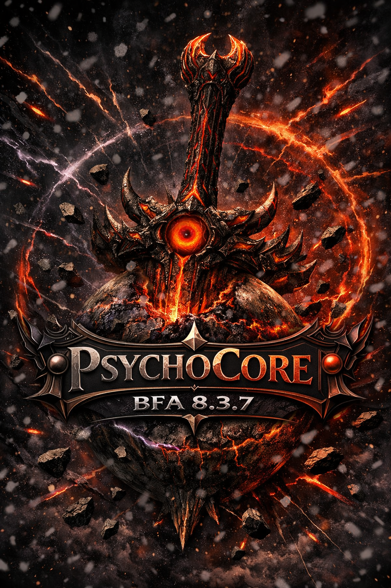

# Psycho_Core 8.3.7 — Reforged + Modernized

<p align="center">
  
</p>

> **IMPORTANT REMINDER: CURRENTLY UNDER DEVELOPMENT BY A COMPLETE NOOB WITH AN INTERNET CONNECTION!**


A modernized TrinityCore-based emulator for **World of Warcraft: Battle for Azeroth**,
descended from [TrinityCore](https://github.com/TrinityCore/TrinityCore), with a
refreshed toolchain (CMake 4.3.2, Boost 1.83, OpenSSL 3.5.x) and MariaDB 11.8.6 (tested)
as the recommended database.

---

## What this is

A **World of Warcraft: Battle for Azeroth 8.3.7 (build 35662)** private-server emulator,

This is *not* a binary release — you compile it yourself from this repository
against your own MariaDB and (eventually) feed it the data files (maps, vmaps,
mmaps, DB2/DBC) extracted from a real BfA 8.3.7 WoW client.

---

## Highlights of this branch

| Area | Change |
|---|---|
| **CMake** | `cmake_minimum_required(VERSION 4.3.2)` — bumped from the original 3.8 to the current CMake 4.3 series. |
| **Boost** | Target floor **1.83** on both Linux and Windows. The Asio layer (`src/common/Asio/*`) already guards `BOOST_VERSION >= 1.66 / 1.70`, so 1.83 works without code changes. (Avoid Boost ≥ 1.87 — it removes the `io_service` alias still referenced here.) |
| **OpenSSL** | Target **3.0 LTS**. The crypto code is already mostly OpenSSL-1.1-API-aware (`EVP_MD_CTX_new`, opaque structs with version guards). A small set of patches is required before a 3.x build compiles — see **Build status → Known blockers**. |
| **MariaDB** | **11.8.6** tested on Linux (Debian trixie). `cmake/macros/FindMySQL.cmake` locates the connector via `mysql_config` / `libmysqlclient` + headers. |

---

## Requirements

| Component | Minimum / Target | Notes |
|---|---|---|
| **CMake** | 4.3.2 | Bumped this branch (top-level + `contrib/protoc-bnet`). |
| **C++ standard** | C++14 | Set via `CXX_STANDARD 14`. |
| **GCC** (Linux) | 6.3.0 | Original floor; GCC 11+ recommended alongside OpenSSL 3 / Boost 1.83. |
| **Clang** (Linux) | recent | Supported by the platform settings. |
| **MSVC** (Windows) | 19.24 (VS 2019 16.4) | Original floor for this BfA base. |
| **Boost** | 1.83 | Components: system, filesystem, thread, program_options, iostreams, regex. |
| **OpenSSL** | 3.5.x (≥ 3.5.5) | Linux: 3.5.5 tested. Windows: use 3.5.6 (latest 3.5.x from slproweb.com). |
| **MariaDB** | 11.8.6 (tested) / 10.6 LTS | Debian trixie provides 11.8.6. Windows: download 10.6 LTS .msi from mariadb.com. |
| **zlib** | 1.2.11 (vendored) | Plus bzip2, readline (system on Linux). |

All other third-party libraries are vendored under `dep/` (fmt, jemalloc, protobuf,
rapidjson, gSOAP, CascLib, recastnavigation, g3dlite, utf8cpp, SFMT, efsw, …).

---

## Quick start

### Linux (Debian/Ubuntu/Fedora)

```bash
# 1. Clone
git clone <your fork URL> Psycho_Core-8.3.7 && cd Psycho_Core-8.3.7

# 2. System prerequisites (Debian/Ubuntu example)
sudo apt-get install -y build-essential cmake git \
    libboost1.83-all-dev \
    libssl-dev libmariadb-dev zlib1g-dev libbz2-dev libreadline-dev

# 3. Configure + build
mkdir build && cd build
cmake ../ -DCMAKE_INSTALL_PREFIX=$HOME/psycho-server -DTOOLS=1 -DWITH_WARNINGS=1
make -j$(nproc)
make install
```

### Windows (Visual Studio 2019/2022)

1. Install Boost 1.83, OpenSSL 3.x, and MariaDB 10.6.3 (set `BOOST_ROOT`).
2. Open the source folder in CMake, choose a Visual Studio generator, **Configure** + **Generate**.
3. Open the generated solution and build `ALL_BUILD` in **Release**.

After compiling, configure `worldserver.conf` / `bnetserver.conf`, import the SQL
databases, extract client data with the tools in `src/tools/`, and start the servers.

---

## Build status

> ✅ **bnetserver compiles successfully on Linux** (CMake 4.3.2, GCC 14.2.0, Boost 1.83, OpenSSL 3.5.5, MariaDB 11.8.6).
> ⚠️ **worldserver build not yet attempted** — The known OpenSSL-3 / CMake-4 source blockers have been resolved (see below).

### OpenSSL 3.x / CMake 4.3.2 compatibility fixes (applied)

| ID | File | Fix |
|---|---|---|
| **P-01** ✅ | `dep/cotire/CMake/cotire.cmake` | `cmake_minimum_required` raised `2.8.12 → 3.5` (CMake 4.x rejects minimums < 3.5). |
| **P-02** ✅ | `cmake/macros/FindOpenSSL.cmake` | Version range raised: floor `1.0 → 1.1.1`, cap `1.2 → 3.6` (exclusive upper bound) so the full OpenSSL `1.1.1 … 3.5.x` range is accepted. |
| **P-03** ✅ | `src/common/Cryptography/OpenSSLCrypto.cpp` | Legacy threading callbacks (`CRYPTO_num_locks`, `CRYPTO_set_locking_callback`, `CRYPTO_THREADID_*`) guarded behind `OPENSSL_VERSION_NUMBER < 0x10100000L`; no-op `threadsSetup`/`threadsCleanup` on OpenSSL 1.1+/3.x. |
| **P-04** ⚪ | `src/common/Cryptography/RSA.cpp` | No change needed — the `_rsa->n` access is already inside the pre-1.1.0 `#else` branch; the 1.1+/3.x path uses `RSA_get0_key()`. |

### What is expected to build (TrinityCore BfA targets)

| Target | Linux | Windows | Notes |
|---|---|---|---|
| `dep/*` vendored dependencies | ✅ | — | g3d, Detour, fmt, jemalloc, protobuf, gsoap |
| `common` | ✅ | — | Crypto, collision, utilities |
| `database` | ✅ | — | MySQL/MariaDB abstraction layer |
| `shared` | ✅ | — | DB2 stores, RealmList, networking |
| `proto` | ✅ | — | BNet `Client/*` descriptors |
| **bnetserver** | ✅ | — | **100% built, zero errors** (2026-06-09) |
| `worldserver` + scripts | ⚠️ | — | Not yet attempted — pending compile test |
| `src/tools/` extractors | ✅ | — | map, vmap, mmap (built in prior configure pass)

---

<p align="center">
  
</p>

## Repository layout

```
Psycho_Core-8.3.7/
├── CMakeLists.txt              Top-level build (CMake 4.3.2)
├── README.md                   This file
├── cmake/                      Find* macros, compiler/platform settings
├── dep/                        Vendored 3rd-party dependencies (CascLib, fmt, …)
├── contrib/                    Helper tools (e.g. protoc-bnet)
├── doc/                        Upstream documentation
├── sql/                        Schema + update SQL files (auth/characters/world/hotfixes)
├── src/
│   ├── common/                 Logging, threading, crypto, utilities
│   ├── server/
│   │   ├── bnetserver/         Battle.net auth server
│   │   ├── worldserver/        Game world server
│   │   ├── database/           DB abstraction layer
│   │   ├── proto/              protobuf message definitions (+ Client descriptors)
│   │   ├── shared/             Shared between bnetserver / worldserver
│   │   ├── game/               Game logic (entities, spells, AI, …)
│   │   └── scripts/            Pluggable script modules (EasternKingdoms, Kalimdor,
│   │                           Northrend, Outland, Pandaria, Spells, World, …)
│   └── tools/                  Map/vmap/mmap extractors
└── revision_data.h.in.cmake    Embeds git SHA into the binary
```

---

## Modules

Psycho_Core supports **drop-in modules**  via a top-level [`modules/`](modules/) folder that plugs into the core's script system.
Modules support **static** linkage (compiled into `worldserver`) or **dynamic**
linkage (separate `.so`/`.dll` with hot-reload).

```bash
cd modules && git clone <module-repo> mod-<name> && cd ..
cmake -S . -B build -DMODULES=static && cmake --build build -j
```

- Template / example: [`modules/mod-skeleton/`](modules/mod-skeleton/)
- Build a module: [`docs/HOW_TO_BUILD_A_MODULE.md`](docs/HOW_TO_BUILD_A_MODULE.md)
- Install modules: [`docs/HOW_TO_INSTALL_MODULES.md`](docs/HOW_TO_INSTALL_MODULES.md)
- Module folder docs: [`modules/README.md`](modules/README.md)

> ⚠️ This is a **BfA 8.3.7** core — modules written for other cores/expansions
> (e.g. AzerothCore WotLK 3.3.5) won't compile unmodified. Start from `mod-skeleton`.

---

## World database (TDB)

This core targets BfA **8.3.7**, so it uses the TrinityCore **TDB 837** database
line. `sql/base/` only ships the **auth** and **characters** base SQL — the
**world** and **hotfixes** data come from the TDB download.

* **Release:** [`TDB 837.20101`](https://github.com/TrinityCore/TrinityCore/releases/tag/TDB837.20101) (2020-10-20) — the final 8.3.x TDB.
* **Archive:** `TDB_full_837.20101_2020_10_20.7z`
  ([direct link](https://github.com/TrinityCore/TrinityCore/releases/download/TDB837.20101/TDB_full_837.20101_2020_10_20.7z))
* **Inside the archive:**
  * `TDB_full_world_837.20101_2020_10_20.sql` → **world** database
  * `TDB_full_hotfixes_837.20101_2020_10_20.sql` → **hotfixes** database

Extract the `.sql` files next to your `worldserver` binary (**do not rename
them**); with the auto-updater enabled (`Updates.EnableDatabases = 15`) they are
imported automatically on first run. Run `sql/create/create_mysql.sql` first to
create the databases and user.

---

## Configuration

Two config files:

* **`worldserver.conf.dist`** — 4,191 lines, ~599 settings, covering game rules,
  network, rates, and tuning. Copy to `worldserver.conf` and edit.
* **`bnetserver.conf.dist`** — Battle.net auth server config (403 lines). Copy to
  `bnetserver.conf` and edit.

Key knobs you'll touch first:

```ini
# Database connection strings
LoginDatabaseInfo     = "127.0.0.1;3306;trinity;trinity;auth"
CharacterDatabaseInfo = "127.0.0.1;3306;trinity;trinity;characters"
HotfixDatabaseInfo    = "127.0.0.1;3306;trinity;trinity;hotfixes"
WorldDatabaseInfo     = "127.0.0.1;3306;trinity;trinity;world"

# Where extracted client data lives
DataDir = "."

# Expansion (Battle for Azeroth = 7)
Expansion = 7
```

---

## Contributing

Patches are welcome. Please:

1. Open an issue first for non-trivial changes.
2. Keep commits focused — one logical change per commit.
3. Don't reformat unrelated code.
4. If your change touches the build system, run a full configure end-to-end and report the result.
5. Conform to the existing TrinityCore-style naming.

The most useful contribution right now is applying the **P-01…P-04** blockers above
and validating a full `worldserver` build.

---

## License

GPL-2.0-or-later (inherited from TrinityCore — see [`COPYING`](COPYING)).
